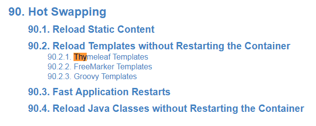
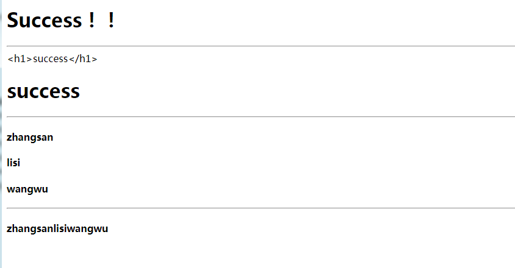
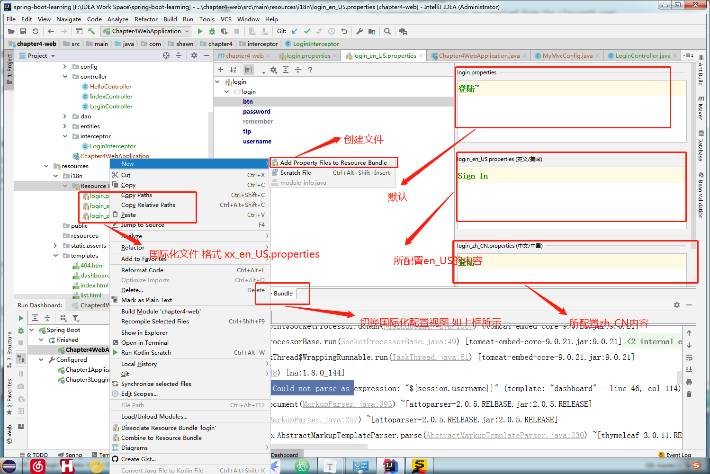

# 初识SpringBoot丨第四篇：整合thymeleaf & 国际化配置

>模板引擎（这里特指用于Web开发的模板引擎）是为了使[用户界面](https://baike.baidu.com/item/用户界面)与业务数据（内容）分离而产生的，它可以生成特定格式的文档，用于网站的模板引擎就会生成一个标准的[HTML](https://baike.baidu.com/item/HTML)文档。

<!-- more -->

目前使用广泛的模板引擎有JSP、Velocity、Freemarker、Thymeleaf等。。SpringBoot推荐使用的分别如下图所示 thymeleaf、freemark、groovy...



下面我就介绍其中thymeleaf的相关整合

## 引入thymeleaf

在pom文件中引入

```xml
<!-- 引入 -->
<dependency>
    <groupId>org.springframework.boot</groupId>
    <artifactId>spring-boot-starter-thymeleaf</artifactId>
    2.1.6
</dependency>

<!-- 切换thymeleaf版本 -->
<properties>
		<thymeleaf.version>3.0.9.RELEASE</thymeleaf.version>
		<!-- 布局功能的支持程序  thymeleaf3主程序  layout2以上版本 -->
		<!-- thymeleaf2   layout1-->
		<thymeleaf-layout-dialect.version>2.2.2</thymeleaf-layout-dialect.version>
</properties>

or

<!-- 布局功能的支持程序  thymeleaf3主程序  layout2以上版本 -->
<thymeleaf-spring5.version>3.0.9.RELEASE</thymeleaf-spring5.version>
<thymeleaf-layout-dialect.version>2.2.2</thymeleaf-layoutdialect.version>
```


## Thymeleaf使用

在springboot中默认为thymeleaf配置了相关配置

```java
@ConfigurationProperties(prefix = "spring.thymeleaf")
public class ThymeleafProperties {

    //默认编码
	private static final Charset DEFAULT_ENCODING = Charset.forName("UTF-8");

    //文本类型
	private static final MimeType DEFAULT_CONTENT_TYPE = MimeType.valueOf("text/html");

    //加载地址
	public static final String DEFAULT_PREFIX = "classpath:/templates/";
	
    //默认后缀
	public static final String DEFAULT_SUFFIX = ".html";
```

有了上方默认配置，只要我们把HTML页面放在classpath:/templates/，thymeleaf就能自动渲染；


### 1、使用

1、在html文件中导入thymeleaf的名称空间

```html
<!-- 引入该名称空间 加入代码提示及规范 -->
<html lang="en" xmlns:th="http://www.thymeleaf.org">
```


2、使用thymeleaf语法

接口：

```java
@RequestMapping(value = "/success")
public String success(Map<String,Object> map){
    map.put("hello","<h1>success</h1>");
    map.put("users", Arrays.asList("zhangsan","lisi","wangwu"));
    return "success";
}
```

**success.html**

```html
<!DOCTYPE html>
<html lang="en" xmlns:th="http://www.thymeleaf.org">
<head>
    <meta charset="UTF-8">
    <title>Title</title>
</head>
<body>
    <h1>Success！！</h1>

    <hr/>
    <!-- th:text 将div里面的文本内容设置为变量值 ,不转义特殊字符
         th:utext 将div里面的文本内容设置为变量值 ,转义特殊字符
        th:id 将div的id值设为该变量
        th:class 将div的class属性设置为该变量
    -->
    <div th:text="${hello}" th:id="${hello}" th:class="${hello}"></div>
    <div th:utext="${hello}" th:id="${hello}" th:class="${hello}"></div>

    <hr>
    <!-- th:each 每次比遍历都会生成一个新的标签 -->
    <!--：3个h4标签-->
    <h4 th:text="${user}" th:each="user : ${users}"></h4>

    <hr>
    <h4>
        <!--：3个span标签-->
        <span th:text="${user}" th:each="user : ${users}"></span>
    </h4>
</body>
</html>
```

浏览器访问结果：




### 2、语法规则

1）、th:text；改变当前元素里面的文本内容；

​	th：任意html属性；来替换原生属性的值


2）、表达式？

```properties
Simple expressions:（表达式语法）
    Variable Expressions: ${...}：获取变量值；OGNL；
    		1）、获取对象的属性、调用方法
    		2）、使用内置的基本对象：
    			#ctx : the context object.
    			#vars: the context variables.
                #locale : the context locale.
                #request : (only in Web Contexts) the HttpServletRequest object.
                #response : (only in Web Contexts) the HttpServletResponse object.
                #session : (only in Web Contexts) the HttpSession object.
                #servletContext : (only in Web Contexts) the ServletContext object.
                
                ${session.foo}
            3）、内置的一些工具对象：
#execInfo : information about the template being processed.
#messages : methods for obtaining externalized messages inside variables expressions, in the same way as they would be obtained using #{…} syntax.
#uris : methods for escaping parts of URLs/URIs
#conversions : methods for executing the configured conversion service (if any).
#dates : methods for java.util.Date objects: formatting, component extraction, etc.
#calendars : analogous to #dates , but for java.util.Calendar objects.
#numbers : methods for formatting numeric objects.
#strings : methods for String objects: contains, startsWith, prepending/appending, etc.
#objects : methods for objects in general.
#bools : methods for boolean evaluation.
#arrays : methods for arrays.
#lists : methods for lists.
#sets : methods for sets.
#maps : methods for maps.
#aggregates : methods for creating aggregates on arrays or collections.
#ids : methods for dealing with id attributes that might be repeated (for example, as a result of an iteration).

    Selection Variable Expressions: *{...}：选择表达式：和${}在功能上是一样；
    	补充：配合 th:object="${session.user}：
   <div th:object="${session.user}">
    <p>Name: <span th:text="*{firstName}">Sebastian</span>.</p>
    <p>Surname: <span th:text="*{lastName}">Pepper</span>.</p>
    <p>Nationality: <span th:text="*{nationality}">Saturn</span>.</p>
    </div>
    
    Message Expressions: #{...}：获取国际化内容
    Link URL Expressions: @{...}：定义URL；
    		@{/order/process(execId=${execId},execType='FAST')}
    Fragment Expressions: ~{...}：片段引用表达式
    		<div th:insert="~{commons :: main}">...</div>
    		
Literals（字面量）
      Text literals: 'one text' , 'Another one!' ,…
      Number literals: 0 , 34 , 3.0 , 12.3 ,…
      Boolean literals: true , false
      Null literal: null
      Literal tokens: one , sometext , main ,…
Text operations:（文本操作）
    String concatenation: +
    Literal substitutions: |The name is ${name}|
Arithmetic operations:（数学运算）
    Binary operators: + , - , * , / , %
    Minus sign (unary operator): -
Boolean operations:（布尔运算）
    Binary operators: and , or
    Boolean negation (unary operator): ! , not
Comparisons and equality:（比较运算）
    Comparators: > , < , >= , <= ( gt , lt , ge , le )
    Equality operators: == , != ( eq , ne )
Conditional operators:条件运算（三元运算符）
    If-then: (if) ? (then)
    If-then-else: (if) ? (then) : (else)
    Default: (value) ?: (defaultvalue)
Special tokens:
    No-Operation: _ 
```


### 3、优化配置

> 模板热部署

在 `IntelliJ IDEA` 中使用 `thymeleaf` 模板的时候，发现每次修改静态页面都需要重启才生效，这点是很不友好的，百度了下发现原来是默认配置搞的鬼，为了提高响应速度，默认情况下会缓存模板。如果是在开发中请**将spring.thymeleaf.cache 属性设置成 false**。在每次修改静态内容时**按Ctrl+Shift+F9**即可重新加载了…


> application配置项


## 国际化配置

+ 编写国际化配置文件；

+ 使用ResourceBundleMessageSource管理国际化资源文件

+ 在页面使用fmt:message取出国际化内容

同样的 ，springboot也已经为我们配置好了挂你国际化资源文件的组件

如下为SpringBoot的自动配置文件部分代码：

```java
@ConfigurationProperties(prefix = "spring.messages") //代表我们在application 文件配置此相关配置的前缀
public class MessageSourceAutoConfiguration {
    
    /**
	 * Comma-separated list of basenames (essentially a fully-qualified classpath
	 * location), each following the ResourceBundle convention with relaxed support for
	 * slash based locations. If it doesn't contain a package qualifier (such as
	 * "org.mypackage"), it will be resolved from the classpath root.
	 */
	private String basename = "messages";  
    //我们的配置文件可以直接放在类路径下叫messages.properties；
    
    @Bean
	public MessageSource messageSource() {
		ResourceBundleMessageSource messageSource = new ResourceBundleMessageSource();
		if (StringUtils.hasText(this.basename)) {
            //设置国际化资源文件的基础名（去掉语言国家代码的）
			messageSource.setBasenames(StringUtils.commaDelimitedListToStringArray(
					StringUtils.trimAllWhitespace(this.basename)));
		}
		if (this.encoding != null) {
            //配置默认编码
			messageSource.setDefaultEncoding(this.encoding.name());
		}
		messageSource.setFallbackToSystemLocale(this.fallbackToSystemLocale);
		messageSource.setCacheSeconds(this.cacheSeconds);
		messageSource.setAlwaysUseMessageFormat(this.alwaysUseMessageFormat);
		return messageSource;
	}
```


### 1、编写国际化配置文件，抽取页面需要显示的国际化消息

首先创建一个存放国际化配置文件的文件夹，其中配置文件名中只需要包含国际化编码信息（如：en_US、zh_CN等...) idea则会自动帮我们建立国际化视图




### 2、文本配置

springboot相关配置文件配置

application.properties

```properties
#springboot已经为我们配置好了默认配置  如下只是示例
spring.messages.basename=i18n.login
spring.messages.always-use-message-format=false
spring.messages.encoding=utf-8
```


### 3、在html中使用thymeleaf获取国际化配置的值

index.html

```html
<!-- 引入格式 #{besename.value} 如#{login.tip} -->
<h1 class="h3 mb-3 font-weight-normal" th:text="#{login.tip}">Please sign in</h1>
			<p style="color: red;" th:text="${msg}" th:if="${not #strings.isEmpty(msg)}"></p>
			<label class="sr-only" th:text="#{login.username}">Username</label>
			<input type="text" name="username" class="form-control" placeholder="Username" th:placeholder="#{login.username}" required="" autofocus="">
			<label class="sr-only" th:text="#{login.password}">Password</label>
			<input type="password" name="password" class="form-control" placeholder="Password" required="" th:placeholder="#{login.password}" >
			<div class="checkbox mb-3">
				<label>
          <input type="checkbox" value="remember-me" />[[#{login.remember}]]
        </label>
			</div>
			<button class="btn btn-lg btn-primary btn-block" type="submit" th:text="#{login.btn}">Sign in</button>
			<p class="mt-5 mb-3 text-muted">© 2017-2018</p>

<!--  简单例子 切换请求-->
			<a class="btn btn-sm" th:href="@{/index.html(l='zn_CN')}">中文</a>
			<a class="btn btn-sm" th:href="@{/index.html(l='en_US')}">English</a>
		</form>
```

IndexController 文件映射controller层

```java
@Controller
public class IndexController {

    @RequestMapping(value = {"/","/index"})
    public String Index(){
        return "index";

    }
```

自定义国际化配置类

```java
package com.shawn.chapter4.component;

public class MyLocaleResolver implements LocaleResolver {
    @Override
    public Locale resolveLocale(HttpServletRequest httpServletRequest) {
        String l = httpServletRequest.getParameter("l");
        Locale locale = Locale.getDefault();
        if(!StringUtils.isEmpty(l)){
            String[] s = l.split("_");
            locale = new Locale(s[0],s[1]);
        }
        return locale;
    }
```

**将自定义配置类加入bean容器中**

MyMvcConfig 自定义配置类

```java
package com.shawn.chapter4.config;

@Configuration
public class MyMvcConfig implements WebMvcConfigurer {
    ...
        
     @Bean
    public LocaleResolver localeResolver(){
        return new MyLocaleResolver();
    }
}
```

如此国际化配置就配置完成了


**配置原理**：

**spring boot在会在启动时加载所有国际化配置类**

WebMvcAutoConfiguration web相关自动配置类（后续文章会详细描述）：

```java
@Configuration
@ConditionalOnWebApplication(
    type = Type.SERVLET
)
@ConditionalOnClass({Servlet.class, DispatcherServlet.class, WebMvcConfigurer.class})
@ConditionalOnMissingBean({WebMvcConfigurationSupport.class})
@AutoConfigureOrder(-2147483638)
@AutoConfigureAfter({DispatcherServletAutoConfiguration.class, TaskExecutionAutoConfiguration.class, ValidationAutoConfiguration.class})
public class WebMvcAutoConfiguration {

		@Bean
        @ConditionalOnMissingBean
        @ConditionalOnProperty(
            prefix = "spring.mvc",
            name = {"locale"}
        )
    	//国际化相关配置内容
        public LocaleResolver localeResolver() {
            if (this.mvcProperties.getLocaleResolver() == org.springframework.boot.autoconfigure.web.servlet.WebMvcProperties.LocaleResolver.FIXED) {
                return new FixedLocaleResolver(this.mvcProperties.getLocale());
            } else {
                AcceptHeaderLocaleResolver localeResolver = new AcceptHeaderLocaleResolver();
                localeResolver.setDefaultLocale(this.mvcProperties.getLocale());
                return localeResolver;
            }
        }
}


//如上所示 只需要实现LocaleResolver接口即可表明这是一个国际化配置容器
public class AcceptHeaderLocaleResolver implements LocaleResolver {

}
```


## 相关资料

[springboot官方文档](https://docs.spring.io/spring-boot/docs/current/reference/html/howto-hotswapping.html#howto-reload-thymeleaf-content)


[github相关项目](https://github.com/ShawnJim/spring-boot-learning/tree/master/chapter4-web)

